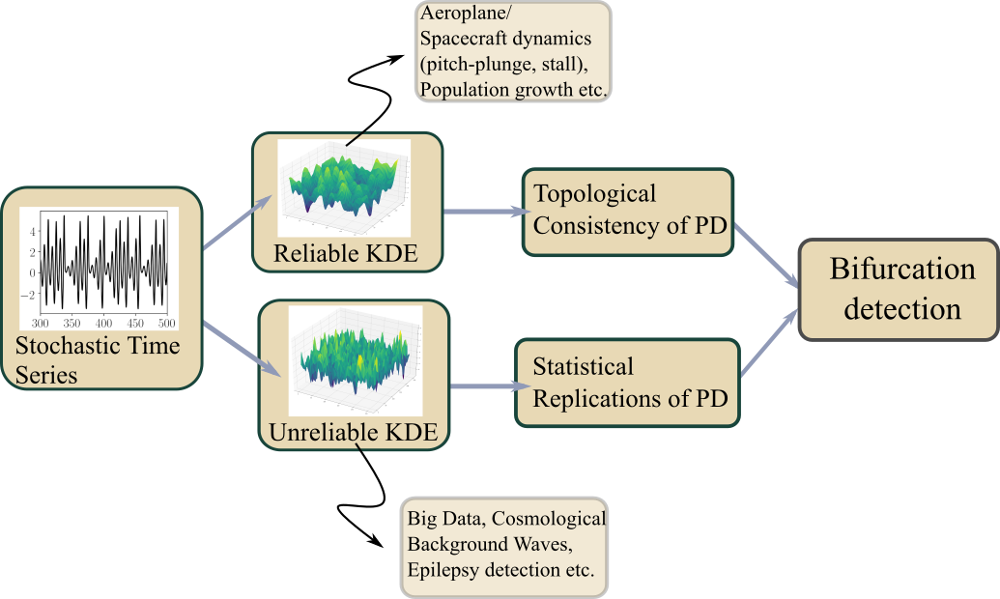
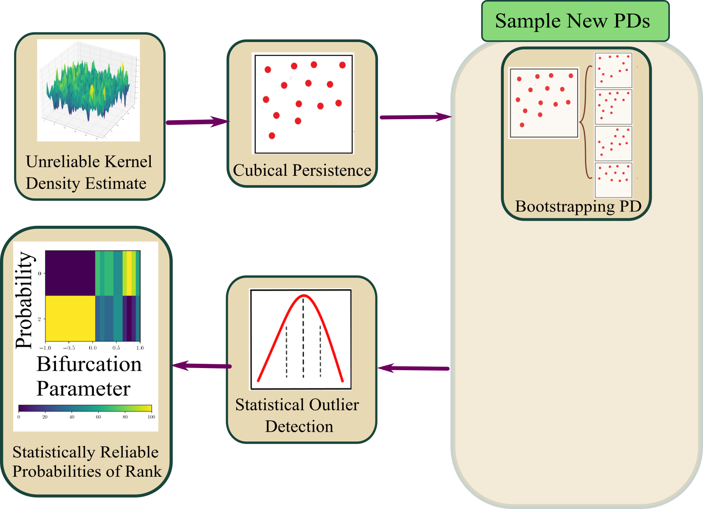
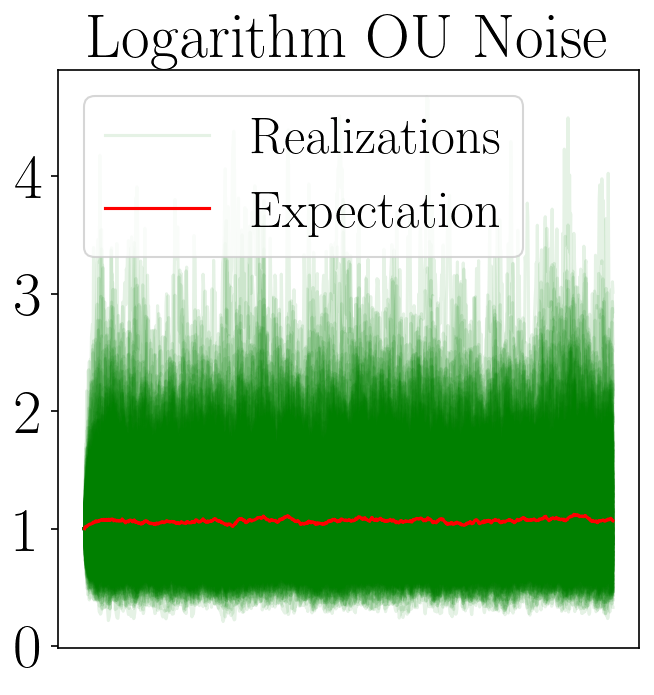
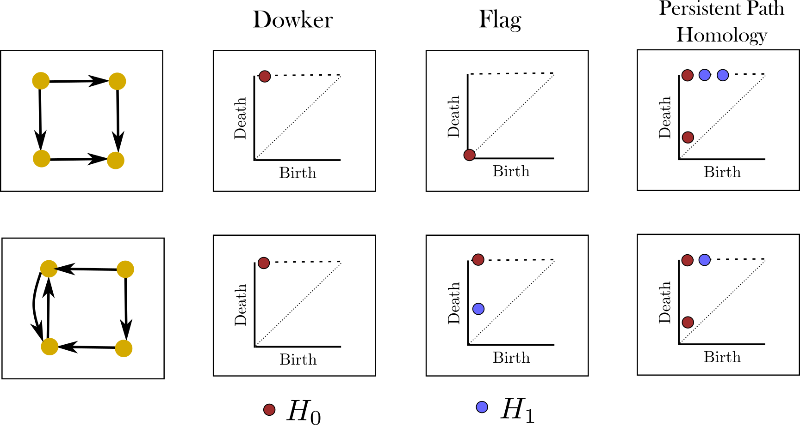

background-image: url("people/people.png")
background-size: 1200px
background-position: 100% 65%
<!-- ------------------------------------------------------- -->
<!-- DO NOT REMOVE -->

```{r setup, include=FALSE}
library(knitr)
options(htmltools.dir.version = FALSE)
knitr::opts_chunk$set(echo = FALSE)
knitr::opts_chunk$set(fig.align = 'center')
```

```{r xaringan-panelset, echo=FALSE}
xaringanExtra::use_panelset()
```

```{r xaringan-tile-view, echo=FALSE}
xaringanExtra::use_tile_view()
```

```{r xaringan-tachyons, echo=FALSE}
xaringanExtra::use_tachyons()
```

```{r xaringanExtra-freezeframe, echo=FALSE}
xaringanExtra::use_freezeframe(
  selector = ".freeze-gif",
  trigger = "click",
  overlay = TRUE,
  responsive = TRUE
)
```

```{r xaringan-editable, echo=FALSE}
xaringanExtra::use_editable(expires = 1)
```

```{r xaringan-scribble, echo=FALSE}
xaringanExtra::use_scribble()
```

<!-- ------------------------------------------------------- -->
<!-- Adjust collaborator image size and position (DO NOT INSERT ANY CODE ABOVE THIS)-->

# Acknowledgements

???
Before starting, I would like to thank all of my collaborators, Dr Khasawneh, Dr Munch, Dr Mamis, Dr Subrahmaniyam, and Josh Templeman. I would also like to thank Airforce Office of Scientific Research for funding this work.

---
# Motivation

???
Dynamical systems are widespread in nature. The motivation for my thesis stems from the growing need to develop robust methodologies for understanding and interpreting dynamic phenomena in various domains, such as aeroelasticity, chemical synthesis, neuroscience, financial markets, travel and transport, and population dynamics.

My objective for this thesis is to leverage stochsatic systems theory and topologicla data analysis for understanding dynamical systems.

--


--


--


--


--


--


--

<br><br><br><br><br><br><br><br><br><br><br><br><br>

.bg-washed-green.b--dark-green.ba.bw2.br3.shadow-1.ph1.mt1[
Objective: Leverage stochastic systems theory and topological data analysis for studying dynamical systems
]

---

???

A signal from a dynamical system which exhibits no clear pattern may be stochastic or deterministically chaotic, possibly with observation noise. It is important to be able to determine this so that the right tools are used for analysing the system. So, Chapter 1 of my thesis discusses a novel technique for identifying whether a time series is from a deterministic or a stochastic system. 

Then, in Chapter 2, I talk about a topology driven detection method for a bifurcation in stochastic systems referred to as phenomenological (P) bifurcation. 

In Chapters 3 to 5, I explore some applications of P-bifurcations in real-world systems such as modelling of aerofoil dynamic stall flutter, epidemic modelling with compartmental models, and epileptic seizure detection. 

Then, Chapter 6 is an attempt at proposing a refined and less computationally expensive algorithm for distinguising basins of attraction from attractors in deterministic systems using a markov chain based algorithm. 

Finally, Chapter 7 discusses a noise robust topology-based algorithm for detecting all zero-crossings in a discrete time signal.

Overall, this thesis is aimed at contributing to advancing the applications of topology in signal processing and dynamical systems. 

--


---
# Homology

???
Before we dive into each of these chapter, let's recap some basic concepts in computational topology.

The shape of data is measured with something called homology. This mathematical construction returns a vector space representing some aspect of the shape. 

Different dimensions of homology measure different shapes – 0-dimensional homology measures the number of clusters; 1-dimensional homology measures holes or loops; 2-dimensional homology measures voids; and there are higher dimensional analogues as well. 

On the right are displayed the homology groups for these spaces, however all that really matters for us is the dimension of the vector space, which can be seen now 

As you can see, all the spaces have one connected component, so they all have 0-dimensional homology rank 1. The number of loops are measured by 1-dimensional homology. E.g, the circle here has one loop, so it has rank 1 for 1-dimensional homology. The torus has two loops, one going around the top, and one through the center, leading to a rank of 2 for 1-dim homology.

--

.pull-left[
### What is Homology?
A topological invariant which assigns a vector space, $H_k(X)$, to a given topological space $X$.

### Dimension:

$k$ is the dimension

- 0: Clusters
- 1: Holes
- 2: Voids
]


--


---
# Persistent Homology

???
Now we look at the modern variant of homology, known as persistent homology. This is a way to study the changing shape of a changing topological space, this filtration here, by encoding its changing homology. 

We keep track of when structures appear and disappear in homology, giving us information about the structure of the space itself. 

When a new structure appears, we say that it has taken birth, and when it disappears, we say that it has died. These birth and death pairs are recorded on a persistence diagram which we'll look at on the next slides.

Next, I'll be recapping three forms of persistent homology which we'll need for this presentation. 

--

A way to watch how the homology of a filtration (sequence) of topological spaces changes so that we can understand something about the space.

--

.center[Given topological space $K$ and filtration

$K_0 \subseteq K_1 \subseteq K_2  \subseteq \cdots \subseteq K_n$

gives a sequence of maps on  homology

$H_1(K_0) \xrightarrow{} H_1(K_1) \xrightarrow{} H_1(K_2) \xrightarrow{} \cdots \xrightarrow{} H_1(K_n)$
]

--
.center[
Appearance $\xrightarrow{}$ Birth (b)

Disappearance $\xrightarrow{}$ Death (d)

Encoded on **Persistence Diagrams** as (b, d)
]

---
# Point-Cloud Rips Persistence (Sublevel)

???
In point-cloud persistence, the parameter varied to measure the changing homology is the radius of balls centered at each point in the dataset. As the radius of those balls is increased, some points "connect" with each in the shape of a loop which is indicated by the birth of an H1 component. As this radius is increased further, the balls fill the loop, signifying the death of the loop. 

These birth and death pairs are recorded as points on the persistence diagram displayed on the right.

Take a look at this point cloud whose underlying shape has two loops. As we increase the radius of the balls, they merge to indicate the birth of one loop. On further increase, another loop is born. And on further increase, one of the loops dies. 
--


---
# Image Cubical Persistence (Superlevel)

???
Cubical persistence is another form of persistent homology, where we deal with 2D or image data and base the parametrization on the height or function value of the data. 

E.g. for data displayed in the middle, the superlevel cubical persistence is carried out by slowly "decreasing" the level from the top, and binarizing the data into sets above and below level. All data above (which will be displayed in white on the diagram in the left) is included in computing of superlevel persistence while the data below (which will be displayed in black) is ignored in the homology computation.

We begin with one connected component and one loop at the top. As we lower the threshold, we notice another connected component taking birth. Once the two connected components merge, we record the death of the younger component. Further, as we lower the threshold, we see that the loop fills up which is recorded as the death of the H1 component. Once we've reached the bottom, the remaining connected component also dies.

--


---
# Signal Persistence (Sublevel)

???
This is the last persistence type we'll be using. Technically, it's the same as the image persistence except that it's being computed for 1D signals instead of 2D images. In this case, it's easier to see the persistence as a pair of minimas and maximas of the 1D signal. 

E.g. in the animation, we see three persistence points taking birth when the level reaches the minimas, and dying one by one when the level reaches their corresponding maximas. 

--


.footnote[Animation Credits: Dr Audun Myers, Pacific Northwest National Laboratory.]

---

???
In Chapter 1, I will discuss two recently defined properties on stochastic signals which I hypothesize can be used to differentiate deterministic signal from stochastic signals. The first one connects the number of points with a fixed persistence as a function of quadratic variation, and the second one connects the persistence points in a specific box to the number of zero-crossings of the signal. 

--


---
# Function to Tree

???

These theorems I mentioned have been derived from trees constructed from signals. Let's look at how such a tree is generated. 
Given a continous function, a tree can be constructed from it by setting a root node against the global minima and maxima (shown as the red point at the bottom), from there moving upwards towards the maxima, and then adding a branch every time you hit a local minima. Each of these branches is given the length of the global maxima on the side of the branch, as shown in this animation. 

--

.footnote[Perez, D.: On C0-persistent homology and trees (2020). arXiv:2012.02634]

<!--- $f: \mathbb{R} \xrightarrow{} \mathbb{R}$ --->
<!--- $d_f(x,y) = f(x) + f(y) - 2\min {f(\Omega (s))}$ --->
<!--- $\Omega \text{ is a path from } x \text{ to } y$ --->
<!--- $T_f = \mathbb{R} / \{x \sim y \iff d_f(x, y) = 0\}$ --->


--


--


---
# Tree to Persistence Barcode and Diagram

???

Based on this construction, you can probably intuitively tell that it has to be connected with the sublevel persistence on a signal I described earlier. Turns out, the connection is 1-to-1. Each leaf of the tree corresponds to a persistence barcode which can be used to get the the persistence diagram for that signal.

That is, each branch in the tree we constructed corresponds to one point in the persistence diagram of the signal. 

--
.footnote[Perez, D.: On C0-persistent homology and trees (2020). arXiv:2012.02634]

<!---  --->


--

--

--

--

--

--


---
## Theorems Connecting Persistence with Stochastic Signals

???

As I mentioned, these theorems have technically been defined on trees built from stochastic signals, but since the tree and persistence diagram have a one-to-one relation, the theorems can be used to connect the persistence diagram with signal properties directly.

The first theorems Perez defines in his paper dictates that for stochastic signals, the expectation of the number of points of length greater than epsilon, is a function of the quadratic variation, [X]_t. Since quadratic variation for a continous deterministic signal is 0, this theorem obviously doesn't hold true for deterministic signals, and should give us a reasonable way of differentiating between stochastic signals and determinstically chaotic signals.

The second theorem connects the number of up-down crossings of a stochastic signal to the number of points in this green box in the persistence diagram.

--

<!--- $\mathbb{E}[N^\epsilon] = \frac{[M]_t}{2\epsilon^2} + \frac{2}{3} + 2\sum_{k \geq 1}(2(-1)^k - 1)\frac{\exp{\left(-\pi^2 k^2 [M]_t / 2\epsilon^2[M]_t\right)}}{\epsilon^2}\left[1 + \frac{\epsilon^2}{\pi^2 k^2 [M]_t}\right]$ --->

.footnote[D. Perez, "On the persistent homology of almost surely c0 stochastic processes,” Journal of Applied and Computational Topology, vol. 7, pp. 879–906, July 2023.]

<!--- .absolute.top-4.right-1.pa3.bg-light-gray.br3.shadow-1[$$[X]_t = \sum_{k=1}^n (X_{t_k} - X_{t_{k-1}})^2$$] --->

--

- Number of bars of length $\geq \epsilon$
$$E[N^\epsilon] = \frac{[X]_t}{2\epsilon^2} + O(\epsilon^{-3/2}) \text{ as } \epsilon \rightarrow{} 0$$


.absolute.top-2.right-2.pa0.bg-light-gray.br3[$$[X]_t = \int_0^t \sigma^2_s ds $$]

--

- Number of points of persistence in rectangle $(-\infty, x] \times [x+\epsilon, \infty)$
$$N^{x, x+\epsilon} = \min{(D^{x, x+\epsilon}, U^{x, x+\epsilon})} \leq D^{x, x+\epsilon} + 1$$


---
# Expectation of Number of Barcodes 

???

Let's look at some results I generated from the first theorem.

Fixing the quadratic variation, I first tested out this theorem on pure brownian noise, pure gaussian noise and chaotic lorenz with gaussian noise. While results from brownian noise closely follow the theoretical estimates, the ones from gaussian noise and a deterministic signal with additive noise don't, giving us a successful way of determining whether a signal is pure brownian or any other type. 

--

.absolute.top-2.right-2.pa0.bg-light-gray.br3[$$E[N^\epsilon] = \frac{[X]_t}{2\epsilon^2} + O(\epsilon^{-3/2})$$
]


---
# Expectation of Number of Barcodes 

.absolute.top-2.right-2.pa0.bg-light-gray.br3[$$E[N^\epsilon] = \frac{[X]_t}{2\epsilon^2} + O(\epsilon^{-3/2})$$
]


???

Next, I wanted to test the theorem on chaotic lorenz system with no noise, AWGN and stochasticity.

I plotted the number of persistence points and the function of epsilon and quadratic variation for pure chaotic lorenz, pure chaotic lorenz with additive noise and stochastic lorenz. 

As you can see, the pure chaotic lorenz has a very different plot compared to chaotic lorenz with additive noise and stochastic lorenz. The plot for pure chaos has a step-like shape while the ones with noise or stochasticity have more continuiuty.

This method succeeds in diferentiating between pure chaos and stochastic signal, but does not work well for additive noise vs stochasticity.

--


--


<!--- --- --->
<!--- # Differences in Persistence Diagrams --->

<!---  --->

---
# Future Plan

???

In the future, I plan to test out multiple things to establish a method for differentiating chaos with additive noise and stochasticity.

1- I will use filtration methods on both signal and persistence diagrams before inserting them in the previous pipeline to see if simply filtering the noise from the chaos with additive noise signal helps in separating it from a stochastic version of it. For filtering the persistence diagram, I plan to use a method called ANAPT published by Myers et al. (mentioned in footnotes)

2- I plan to investigate if the theorems defined on up-down crossings of stochastic signals are capable of differentiating additive noise signals from stochastic signals. For this, I will be utilizing my noise-robust zero crossings detection method built using TDA, cited at the bottom. 

That wraps up my preliminary results and future plan for chapter 1.

--

.footnote[Myers, A.D., Khasawneh, F.A., Fasy, B.T.. ANAPT: Additive noise analysis for persistence thresholding. Foundations of Data Science, 2022, 4(2): 243-269. doi: 10.3934/fods.2022005

Tanweer, S., Khasawneh, F.A., & Munch, E. Robust crossings detection in noisy signals using topological signal processing (2024). Foundations of Data Science.]


---

???

Once you've established that a signal is stochastic, you might be interested in analyzing its bifurcation behaviour. In this chapter, I will discuss a topology-based algorithm for detecting phenomenonlogical aka P bifurcations in a stochastic signal. 

I have established the motivation, necessary definitions and the reliable kernel densities part of this work in a video sent out to the committee. But just to recall, a P-bifurcation is defined as the change in shape of the joint probability density function of a stocahstic signal as a bifurcation parameter is varied. 

--


---
# Stochastic Duffing Oscillator

$$\ddot{X} + \dot{X} + \color{red}{h}X + X^{3} = dW$$

???
I will demonstrate our methods on the stoch. duffing oscillator.

A certain duffing oscillator forced by white noise can be represented by the given equation. Its analytical PDF has the given formula where C is a normalizing constant and h is the bifurcation parameter.

This oscillator has two states. For negative h, it is bistable, while for non-negative h, it is monostable. If you take these PDFs' superlevel cubical persistences, you'll see 2 and 1 H_0 points respectively.

--

$$p_{x_{1}x_{2}}(\textbf{x}) = C\exp\left[-\frac{1}{2}\left(x^{2}_{2} + \color{red}{h}x^{2}_{1} + \frac{1}{2}x^{4}_{1}\right)\right]$$

--


<div style="position:absolute; left:10%; bottom:35%; background-color: #8ebf42; border-radius: 10px; padding: 1%; font-family: Times New Roman">
<em>h < 0</em>
</div>


<div style="position:absolute; left:60%; bottom:35%; background-color: #8ebf42; border-radius: 10px; padding: 1%; font-family: Times New Roman">
<em>h >= 0</em>
</div>

--


---
# Betti Vector

???

Since we'll be dealing with many different PDFs over a changing bifurcation parameter with their corresponding persistence diagrams, we need to be able to distill those 2-dimensional persistence diagram to a lower dimension alternative. We find this alternative in the form of a betti vector. 

So, let's define what that is: 

Given a complex, we defined the p-th betti number as the dimension of the p-dimensional homology and the betti curve as a function mapping to the $i$-th betti number of the space at a specific filtration value.

Given a full persistence diagram, an easy way to compute the betti curve is to slowly change your filtration parameter, and count the number of points in the diagram which persist in that range. 

--

### Betti Number

The Betti number $\beta_p(K)$ is the dimension of the $p$-dimensional homology, $\dim(H_p(K))$.

--

### Betti Vector

Given a filtration $K_0 \subseteq K_1 \subseteq \cdots K_n$
the Betti curve is a function 
    $$t \mapsto \left(\beta_i (K_{\lfloor t \rfloor})\right)$$

--
       
Given a persistence diagram, the Betti curve is the function $\beta: \mathbb{R} \rightarrow \mathbb{N}$ whose value on $t \in \mathbb{R}$ is the number of points $(b_i, d_i)$ on the diagram such that $d_i \leq t < b_i$

---
# Betti Vector

???
Let's look at this animation. On the left is the image data and the cubical complex as we change our filtration parameter. In the middle is the persistence diagram and on the right is the betti curve. 

On the persistence diagram, you will see two dynamic lines making a small window. Essentially, at each filtration level, the betti curve's value corresponds to the number of points falling within that window (which is sometimes referred to as the fundamental window). 

--


---
background-image: url("figs/bifurcation_plot.gif")
background-size: 37.5%
background-position: 50% 70%

# Homological Bifurcation Plot

.footnote[Tanweer, S., A. Khasawneh, F., Munch, E., & R. Tempelman, J. (2024). A topological framework for identifying phenomenological bifurcations in stochastic dynamical systems. Nonlinear Dynamics, 112(6), 4687-4703.
]

???
Now that we know how to compute a betti curve, we are in a position to define the homological bifurcation plots we'll be computing to summarize the persistence diagrams of our varying PDFs over a bifurcation parameter. 

Given a parametrized family of filtered complexes, a homological bifurcation plot is a heat map of betti curves for each complex stacked horizontally. This animation shows the plot for a family of PDFs slowly shifting from having 2 gaussian peaks to a single peak. 

In the animation, you can see the changing PDF in the top left, the changing superlevel cubical persistence diagram in the top right and the homological bifurcation plot for 0th dimension of homology at the bottom. The white line on the plot corresponds to the location of the betti curve corresponding to the specific PDF displayed.

Now notice the sea blue region with a value of 2 while the PDF has two peaks. As the two peaks slowly converge into one, the thickness of this sea blue region decreases until it completely vanishes signifying that the PDF has turned into a single peak. 
Hence, this way, a homological bifurcation plot can help summarize the evolution of a PDF over a bifurcation interval.


---
background-image: url("figs/CrockerAnalytical_Duffing.png")
background-size: 42.5%
background-position: 90% 60%

# Homological Bifurcation Plot

.footnote[Tanweer, S., A. Khasawneh, F., Munch, E., & R. Tempelman, J. (2024). A topological framework for identifying phenomenological bifurcations in stochastic dynamical systems. Nonlinear Dynamics, 112(6), 4687-4703.
]


<div style="position:absolute; left:10%; top:22%; background-color: #8ebf42; border-radius: 10px; padding: 10px; font-family: Times New Roman">
<em>h < 0</em>
</div>


<div style="position:absolute; left:10%; top:62%; background-color: #8ebf42; border-radius: 10px; padding: 10px; font-family: Times New Roman">
<em>h >= 0</em>
</div>

???

Back to Duffing oscillator with its two states. The homological bifurcation plot for the Duffing given analytical PDFs looks like the plot on the right. 

The x-axis has the bifurcation parameter, the y-axis has the filtration parameter (level L) while the colors represent the values of the betti vector. Any sudden changes in the colour pattern of consecutive vertical arrays shows a bifurcation---in this case beyond h = 0, we no longer see the value of 2 (color yellow) popping up anywhere in the betti curves.


---
# Bifurcations with Reliable KDEs

???
The plot on the previous slide was generated analytically through the closed-form expression for the PDFs. But typically the analytical PDF of systems is not available. Only the system response is available which can be used to generate histograms or kernel density estimates for the probability density. 

So, given realizations from the system, we can run into two cases: have enough realizations to generate a statistically reliable KDE or have few number of realizations such that the KDE is not entirely reliable. 

Since I sent out a video to the committee on reliable KDEs, I won't go into the details of it but let me recap the general method briefly.

--


--


---
# Detection with Reliable KDEs: Method

???

So the general process in case of a reliable KDE would be as follows:

Given results from a family of experiments with varying bifurcation parameters, we generate corresponding KDEs. 
The homological bifurcation plot as described previously are not resilient to noisy inputs, and so instead of getting the betti vector directly from the persistence diagram, we have to estimate the homology at every levels using point cloud persistence from bottom to top for each KDE using an inclusion map between levels slightly above and slightly below the specific level. The result of doing this is an estimated betti vector of the cubical persistence.

Once all of these betti vectors have been estimated corresponding to the many KDEs, we can plot our estmated homological bifurcation plot which will depict the bifurcation. 

Again, any abrupt change in the colour between two consecutive columns would represent the occurrence of a bifurcation. Such as the change depicted here in the center.

We've  publisged this work in the journal of nonlinear dynamics, as cited in the footnote.

--
     
.footnote[**Tanweer, S.**, A. Khasawneh, F., Munch, E., & R. Tempelman, J. (2024). A topological framework for identifying phenomenological bifurcations in stochastic dynamical systems. Nonlinear Dynamics, 112(6), 4687-4703.
]


--


--


     
--


--


---
# Stochastic Bifurcations: Unreliable KDEs


???
The second case is of insufficient or single realizations from the stochastic system s.t. the generated KDE cannot be statistically relied upon. Let's see how this problem can be tackled to detect bifurcations.

---
# Bifurcation Detection with Unreliable KDEs: Method

.footnote[Tanweer, S., & Khasawneh, F. A. (2024). Topological detection of phenomenological bifurcations with unreliable kernel density estimates. Probabilistic Engineering Mechanics, 76, 103634. 
]


???
When an unreliable KDE is available, the general method would be to compute the persistence diagram for the KDE, and then use that to generate new independent persistence diagrams for compensating the dearth of system realizations. 

Then, statistical methods can be used to reach some sort of probabilistic measure on the occurrence of a bifurcation.

Multiple methods have been proposed in literature to sample new PDs given an original PD. The popular methods are to subsample the PD or to model the original PD as a spatial point process. 

The method of spatial point process modelling assumes taht your statistically unreliable persistence diagram is one realization of some stochastic process. So the method tries to generate a likelihood using the given persistence diagram, and then sample new diagrams from it. 
For generating the likelihood function, the method of Gibbs and Pairwise Interaction Point Process are popular for persistence diagarms.

--


--


--


--


--




--


---
# Gibbs Modelling

.footnote[Robert J. Adler, Sarit Agami, and Pratyush Pranav. “Modeling and replicating statistical topology and evidence for CMB nonhomogeneity”. In: Proceedings of the National Academy of Sciences 114.45 (Oct. 2017), pp. 11878–11883.
]


     
???
The Gibbs model has been adapted from the work by Drs Adler and Agami. 

In a gibbs model, The Local interaction term consists of generating a conditional probability for each point in the PD given K of its neighbours within a given distance r. Then all these conditional probabilities are summed to give a joint density for the local interaction between the points. 

The Global structure for Gibbs model is less complex and is found by generating a kernel density for the points in the diagram. This can be done by any of the standard kernels like gaussian.

Once done with these steps, the local and global terms are combined to give the likelihood which can be used for sampling new points. 

--


--


--


--


--


---
# Pairwise Interaction Point Process Modelling


.footnote[Theodore Papamarkou, Farzana Nasrin, Austin Lawson, Na Gong, Orlando Rios, and Vasileios Maroulas. “A random persistence diagram generator”. In: Statistics and Computing 32.5 (Oct. 2022). issn: 1573-1375.
]


???
Pairwise Interaction Point Process is modelled similarly. This work is adapted from Papamarkou et al. In this model, the local interaction is computed using the number of neighbours in various radii brackets for each point, while the global interaction at each location is proportional to the areas of the voronoi tessalations for each point in the original PD. Similar to Gibbs, both these parts are added to get the likelihood.

--


--


--


--


---
# Stochastic Duffing Oscilator


<div style="position:absolute; left:3%; top:20%; background-color: #8ebf42; border-radius: 10px; padding: 0.5%; font-family: Times New Roman">
<em>h < 0</em>
</div>


<div style="position:absolute; left:3%; top:55%; background-color: #8ebf42; border-radius: 10px; padding: 0.5%; font-family: Times New Roman">
<em>h >= 0</em>
</div>

???
Okay, applying the methods to the Duffing osc. 
I generated 500 new PPDs against each bifurcation parameter using all three methods given an unreliable KDE. And then used outlier detection methods to count the number of true persistence points in the persistence diagrams. The outlier detection methods I used are mahalanobis distance and bootsrapping.

In these figures on teh right, the color represents the probability of the number of significant points in PD being 1 or 2. 

These results are probabilistic, and we're only looking for an indication of somethign changing if not the actual value of the number of persistence points. Then, for this purpose, we can see that the results from subsampling are better than PIPP which is better than Gibbs, since the results from subsampling gives a better indication of change in dynamcis close to the true bifurcaiton point of 0 compared to the other two methods. 

--


---

???
This wraps up the chapter on detection of P-bifurcations. P-bifurcations have many real world applications in brain dynamics, financial modelling, epidemic modeling etc. In my thesis, I will focus on three main applications. The first one, covered in this chapter, is of detecting stall flutter in aerofoils. 

--


---
# P-Bifurcations in Aerofoil Stall Flutter

- Limit cycle flutter poses threat to flight safety
- Causes high amplitude oscillations
- Leads to fatigue damage and failure 


???
Limit cycle flutter is a typical kind of nonlinear dynamics behavior of airfoil dynamics. In stall flutter, the aerofoil undergoes large amplitude oscillations which poses a seroius threat to aircraft health and in turn flight and human safety. Hence, it is very important to detect system parameter ranges where such a behaviour is likely to occur.  

Fr prelimianry results, I considered a 2 dof (pitch and plunge) model of a typical airfoil such that the flow speed is the stochastic bifurcation parameter. Terms in green are all mechanical properties of the aerofoil while L and M represent the lift and moment forces. 
For ease of visualization here, I have used epsilon, a perturbation to U_f which is the bifurcation point, as the bifurcation parameter. 

This is a simple model with the lift nd moment forces modelled proportional to the pitch and flow speed. And the stochasticity is linearly injected in the speed.

--

$\color{green}{M}\ddot{h} + \color{green}{S}\ddot{\alpha} + \color{green}{c_1}\dot{h} + \color{green}{K_h}h = L(t) = -0.1\alpha\color{red}{\bar{U}}$

$\color{green}{S}\ddot{h} + \color{green}{J_E}\ddot{\alpha} + \color{green}{c_2}\dot{\alpha} + \color{green}{K_\alpha} \alpha = M(t) = 0.04\alpha\color{red}{\bar{U}}$

$\color{green}{K_\alpha} = \color{green}{k_1} + \color{green}{k_3}\alpha^2 + \color{green}{k_5}\alpha^4$

$\color{red}{\bar{U}} = U_f + \color{cyan}{\varepsilon} + \color{red}{\xi(t)}$

--


.footnote[Y. Hao, Z. Q. Wu (2019). "Random Flutter Of Multi-Stable Airfoils Excited Parametrically In Steady Flows." Journal of Mechanics Vol. 35, No 3.]

---
# Homological Bifurcation Plot


???
Notice the changes in the probability density as the bifurcation parameter is varied-- From an impulse to a limit cycle surrounding a monostability to a limit cycle. 

The H0 plot shows 1 peak for the most part, but slowly transitions to 2 connected components clsoe to a value of 0. This is indicative of the intermediate stage where a peak exists with a limit cycle. 

The H1 plot shows 0 cycles for values less than 0, and then changes to 1 limit cycle close to 0, indicating the birth of the stochastic limit cycle in the density function.

--


--


-- 


--


---
# Future Plan

.panelset[

.panel[.panel-name[Preliminary Model]

<!--- $\color{green}{M}\ddot{h} + \color{green}{S}\ddot{\alpha} + \color{green}{c_1}\dot{h} + \color{green}{K_h}h = L(t) = -0.1\alpha\color{red}{\bar{U}}$ --->

<!--- $\color{green}{S}\ddot{h} + \color{green}{J_E}\ddot{\alpha} + \color{green}{c_2}\dot{\alpha} + \color{green}{K_\alpha} \alpha = M(t) = 0.04\alpha\color{red}{\bar{U}}$ --->

<!--- $\color{green}{K_\alpha} = \color{green}{k_1} + \color{green}{k_3}\alpha^2 + \color{green}{k_5}\alpha^4$ --->

<!--- $\color{red}{\bar{U}} = U_f + \color{cyan}{\varepsilon} + \color{red}{\xi(t)}$ --->


<br><br><br><br><br><br><br><br><br><br><br><br><br><br>

.footnote[Y. Hao, Z. Q. Wu (2019). "Random Flutter Of Multi-Stable Airfoils Excited Parametrically In Steady Flows." Journal of Mechanics Vol. 35, No 3.
]


]


.panel[.panel-name[Higher Fidelity Model]

<!--- $\ddot{h} + \color{green}{x_{\alpha}}\ddot{\alpha} + \color{green}{\zeta_h}\color{red}{\frac{\omega}{U}}\dot{h} + \color{red}{\left(\frac{\omega}{U}\right)^2}\color{green}{K_h}h = \color{green}{-\frac{1}{\pi \mu}}C_L(t)$ --->

<!--- $\color{green}{x_{\alpha} r_{\alpha}^2} \ddot{h} + \ddot{\alpha} + \color{green}{2 \zeta_{\alpha}} \color{red}{\frac{1}{U}} \dot{\alpha} + \color{red}{\frac{1}{U^2}}\alpha = \color{green}{\frac{2}{\pi \mu r_{\alpha}^2}}C_M(t)$ --->

<!--- $\color{green}{K_h} = 1 + \color{green}{\beta_{h}}h^2, \quad C_L(t) = f(\alpha, \dot{\alpha}, \ddot{\alpha}, h, \dot{h}, \ddot{h}, \phi, t), \quad C_M(t) = g(\alpha, \dot{\alpha}, \ddot{\alpha}, h, \dot{h}, \ddot{h}, \phi, t)$ --->

<!--- $\color{red}{U(t)} = U_f (1 + \sigma \sin{(t\color{red}{\omega_r})}), \quad \color{red}{\omega_r} = \omega_m + \kappa \color{red}{\mathcal{U}[0, 1]}$ --->


<br><br><br><br><br><br><br><br><br><br><br><br><br><br>

.footnote[Venkatrami, J., Sarkar, S., & Gupta, S., "Intermittency in pitch-plunge aeroelastic systems explained through stochastic bifurcations". (2018). Nonlinear Dynamics.
]


]
]


???

This model I used for preliminary results had analytical solutions. In the future, I plan to detect P-bifurcations with homological bifurcation plots in a higher fidelity model for aerofoil flutter. This model is an adaptation of the Leishman-Beddoes dynamical stall model

There are two major differences in this higher fidelity model and the prelimary model I used. 

1-This model defines the lift and moment forces as nonlinear functions of time, and system states.

2-The stochasticity is injected into the system nonlinearly.

Compared to the preliminary model, this one is widely used for modelling airfoil flutter phenomenon. However, due to its high complexity, there is no analytical solution available for it, and hence the true bifurcation point or points are unknown in the wide parameter space.

---

???

Another application of P-bifurcations is epidemiology where stochastic equations are used to model the spread of diseases. 

--


---
# P-Bifurcations in Epidemiology

???
In epidemiology, stochastic compartmental models are used to describe a population in which individuals move between the different compartments. Two popular compartmental models are SIS and SIR models, where S stand for susceptible, I stands for infected and R stands for the recovered proporions of the population.

Here, lambda is the contact rate between individuals, and gamma is the curing rate. In SIS, the individuals of the population can have only two states: either susceptible to infection or infected. While in the SIR model, the individuals can also fall under the third state of having recovered from the illness. A peak at zero population in these PDFs of infected or recovered is particularly important because it suggests that the disease eradication is most likely. 

For these models, the contact rate is typically the parameter where stochasticity is introduced. The most common choice in literature is Gaussian white noise. However, Ornstein-Uhlenbeck noise has also been used due to its property of stabilization around an equilibrium point, because of mean-reverting ability. 

However, recently studies have hypothesized that white and OU noise, due to them taking both positive and negative values, can underestimate the contact rate leading to optimistic resutls. Hence to counter that argument, I have also used the always-positive lognormal OU noise for my simulations.

--


--


--

<br><br><br><br><br><br><br>

.can-edit[
$\lambda(t) = \bar{\lambda} + \sigma \xi(t)$
]

--


--




---
# Simulation Results

???

This slide shows some results for different reprocudction numbers and relative noise intensities for all six models. Notice that the results of lognormal OU tend to differ from white and OU noise in some cases.

In all cases, lognomal OU shows a higher probability peak at 0 while the other two models may have
a higher probability for the non-zero peak in SIR models. In SIS models, it is interesting to note
that lognormal OU shows the popping up of a second peak (at non-zero value) for low R0 as well
while other two noise types do not show a second peak

--


<br><br><br><br><br><br><br><br><br><br><br><br><br><br><br>

- $R_0$ is basic reproduction number
- $\sigma$ is noise intensity

---
# Homological Bifurcation Plots

-- 


???

These figures show the homological bifurcation plots for all three noise types with relative noise intensity as the bifurcation parameter for basic reproduction number of 3. This is considered a high reproduction number for a disease.

For both models, it can be seen that the white and OU noise give two peaks for all noise intensity values, whereas lognormal OU only has a second non-zero peak for high values of noise intensity for SIS and no non-zero peak for the SIR model. This implies that eradication of a disease is very likely for low intensities of noise if the contact rate is perturbed with lognormal OU noise, as opposed to white or OU.

There are two main results of this work:
1-I counter the argument that peaks at 0 are due to the possible negativeity of gaussian and OU noise by demonstrating that even with positive lognormal OU noise, the PDFs have a peak at 0.
2-For higher noise intensities, a non-zero peak tends to pop up for high reproduction values, which would
lead to the possibility of the disease occurring as an endemic forever instead of eradicating
after a while.

This work is nearly complete and a draft is under preparation.

---

???

That wraps up chpter 4.

Next I will discuss the application of P-bifurcations to detection of epileptic seizures using EEG data. 

--


---
# Detection of Epileptic Seizures from EEG Signals 

???
While looking for another real-world problem to apply for my P-bifurcation work, I came across the problem of epileptic seizure detection given EEG signals. 

In EEG of an epileptic patient, three types of regimes can be found. A normal/interictal phase, a preictal phase occurring right before a seizure and an ictal phase which depicts a seizure. 

Each of these regimes' topology differs from the other, hence there is potential for TDA to be able to classify these signals.

--

<br>

Three types of regimes:

--


<div style="position: absolute; left:15%; top:80%; background-color: #8ebf42; border-radius: 10px; padding: 1%; font-family: Helvetica">
<b>Interictal</b>
</div>

--


<div style="position: absolute; left:46%; top:80%; background-color: #8ebf42; border-radius: 10px; padding: 1%; font-family: Helvetica">
<b>Preictal</b>
</div>

--


<div style="position: absolute; left:78%; top:80%; background-color: #8ebf42; border-radius: 10px; padding: 1%; font-family: Helvetica">
<b>Ictal</b>
</div>

---
# Jansen & Rit Neural Model

???
I started my analysis by turning to a numerical model for EEG simulations. The Jansen-Rit neural model is a 6 DOF system of Stochastic DEs used to simulate the interaction between pyramidal neurons and inhibitory interneurons in a brain. The difference of x1 and x2 state variables is said to simulate the behaviour of an EEG signal. Here the variable B is the bifurcation parameter changing which in te (50, 70) interval changes the EEG dynamics. 

--

$\dot{\color{green}{x_0}} = \color{green}{x_3}$

$\dot{\color{green}{x_3}} = 0.06\mathcal{S}(\color{green}{x_1} - \color{green}{x_2})-0.02\color{green}{x_3}-0.01^2\color{green}{x_0}$

$\dot{\color{green}{x_1}} = \color{green}{x_4}$

$\dot{\color{green}{x_4}} = 0.06(\color{red}{p} + 108\mathcal{S}(135 \color{green}{x_0})) - 0.02\color{green}{x_4} - 0.01^2\color{green}{x_1}$

$\dot{\color{green}{x_2}} = \color{green}{x_5}$

$\dot{\color{green}{x_5}} = 0.02\color{blue}{B}(33.75\mathcal{S}(33.75 \color{green}{x_0})) - 0.04\color{green}{x_5} - 0.02^2\color{green}{x_2}$

--

<br>

$EEG = \color{green}{x_1} - \color{green}{x_2}$ such that $\mathcal{S}(z) = \frac{5}{1 + e^{0.56(6 - z)}}$, $\color{red}{p} \sim \mathcal{N}(\mu, \sigma)$ and $\color{blue}{B} \in [50, 70]$. 

---
# Simulations with Jansen-Rit

???
I started by generating KDEs for each EEG regime from the Jansen-Rit model. The normal EEG showed a gaussian KDE, the preictal phase showed a tristable KDE while the ictal phase showed an impulse-like KDE. Based on the earlier part of the presentation, we can see that it's possible for a homological bifurcation plot to detect a seizure as a bifurcation due to the change in the topologies of these KDEs.

--

<br></br>


<div style="position: absolute; left:15%; top:80%; background-color: #8ebf42; border-radius: 10px; padding: 1%; font-family: Helvetica">
<b>Interictal</b>
</div>

--


<div style="position: absolute; left:46%; top:80%; background-color: #8ebf42; border-radius: 10px; padding: 1%; font-family: Helvetica">
<b>Preictal</b>
</div>

--


<div style="position: absolute; left:78%; top:80%; background-color: #8ebf42; border-radius: 10px; padding: 1%; font-family: Helvetica">
<b>Ictal</b>
</div>

---
# Real-World Single Channel Data

???
But, once I moved from the neat simulated EEG data to a real-clinical dataset taken from patients, the KDEs didn't demonstrate the same topology difference between the various regimes possibly due to high noise in the channel or the numerical model depicting ideal dynamics and hence, I couldn't detect a P-bifurcation anymore with real-world data.

--

.footnote[Neurology & Sleep Centre, Hauz Khas, New Delhi]

<br></br>


<div style="position: absolute; left:15%; top:80%; background-color: #8ebf42; border-radius: 10px; padding: 1%; font-family: Helvetica">
<b>Interictal</b>
</div>

--


<div style="position: absolute; left:46%; top:80%; background-color: #8ebf42; border-radius: 10px; padding: 1%; font-family: Helvetica">
<b>Preictal</b>
</div>

--


<div style="position: absolute; left:78%; top:80%; background-color: #8ebf42; border-radius: 10px; padding: 1%; font-family: Helvetica">
<b>Ictal</b>
</div>

---
# Alternative TDA Approach

???
However, if you compute the sublevel 1D signal persistences for each of these regimes from clinal data, you can see differences in the structure of the persistence diagram. E.g. the interictal phase has widely scattered persistence points compared to the fewer and narrowly distributed persistence points in the preictal phase, while the ictal phase too has narrowly distributed and fewer points compared to the normal phase.

This implies that even if the homological bifurcation plot is not able to detect the shift between these three regimes, machine learning models with topological features might be able to classify the signals. 

--


<!--  -->

     
<div style="position: absolute; left:13%; top:90%; background-color: #8ebf42; border-radius: 10px; padding: 1%; font-family: Helvetica">
<b>Interictal</b>
</div>

--
<!--  -->


<!--  -->


<div style="position: absolute; left:46%; top:90%; background-color: #8ebf42; border-radius: 10px; padding: 1%; font-family: Helvetica">
<b>Preictal</b>
</div>

--

<!--  -->


<!--  -->


<div style="position: absolute; left:78%; top:90%; background-color: #8ebf42; border-radius: 10px; padding: 1%; font-family: Helvetica">
<b>Ictal</b>
</div>

---
# Single-Channel EEG

???
Let's look at results from the major non-TDA and TDA features on our single-channel clinical EEG dataset. The x-axis on the heat map represents the feature, the y-axis represents the machine learning classifier and the color-coded cells represent the test accuracy after removing any results with overfitting. Wherever necessary, overfitting of the model to the training set was removed using K-best feature selection. 

The major non-TDA features used in literature are permutation entropy, renyi entropy, tsallis entropy and hurst exponents. The maximum accuracy of classification I was able to achieve using these features was 76.7% which rose to about 79% when all of them were combined.

Likewise, the same analysis was conducted using TDA-based features of Persistence images, carlsson coordinates and template functions and with combining all of them. I have covered the mathematical details of each of these features in a separate video sent to the committee so I won't go into those details. 

The maximum accuracy using these was a little over 85%, which is a good accuracy for a 3-class classification problem with real data, traditional ML models, no preprocessing and no hyperparameter tuning.

--

### Non-TDA Features


<br></br><br></br><br></br>

--

### TDA Features


---
# Multi-Channel EEG

???
Next, I tried expanding this analysis to multi-channel clinical EEG data. This is a work in progress. 

With multi-channel EEG data, the problem lies in choosing how to with fuse data from all channels or reduce the dimension. 

One possible solution is with fusing features from all signals together. In this, we run into the potential of corrupting the extracted features since in an interval of EEG marked as seizure all channels may or may not be depicting a seizure dynamics. Another possible solution is to use channel reduction techniques to pick seizure channels, but that nethod has the potential to heavily reduce the information available to us. 

--
### Problem


.footnote[Picture Credits: Pooja Varghat]

--
<br><br>
### One Possible Solution


---

???

Nevertheless, I tried most methods of dimension reduction like PCA and ICA, and most methods of data / feature fusion, and fed the resulting TDA-features to common ML classifiers. So far, I have witnessed a maximum accuracy of 75%. 

Then, I also tried using homological bifurcation plots on the topographs of EEG data with time as the bifurcation parameter. The lines represent the start and end of the seizure region. Knowing the exact location of transition, you can see some changes in this bifurcation plot but this plot has a lot of fluctuations and noise, so not much can be concluded definitively from it 

--
# Multi-Channel EEG Results

--

- PCA: 62.7%

--

- ICA: 56%

--

- Factor Analysis: 54.3%

--

- SVD: 59.7%

--

- Atom Diagrams: 48%

--

- Feature Fusion and Selection: $\color{green}{75\%}$

--

- Feature Fusion with filtering: 57.7%

--

- Cubical Persistence: 56.7%

--


--


---
# Future Plan

???
In the future, I plan to investigate this problem further with the following techniques:

1- Instead of the traditional dimension reduction techniques, I would like to use unsupervised classification with TDA features to reduce the dimensionality of the system. 

2- I also plan to utilize methods of converting multi-channel time series into graphs and using persistence methods for graphs. In such a method, eaCh channel is treated as a node wjhile a similarity or dissimilarity measure between channels is used as the weight of each edge.

3- Next, I plan to combine point cloud persistence with an optimal state space reconstruction method proposed by Kraemer et al. Unlike methods like takens embedding, this method promises to automatically choose the best dimension and delay for a multi-channel dataset to return an optimal low dimensional state space.

4- Finally, instead of betti vectors in the homological bifurcation plots of topographs, I plan to use simpler measures like the total persistence to detect a possible bifurcation in the topographs of EEG data.

--

.footnote[
A. Marchese and V. Maroulas, “Signal classification with a point process distance on the space of persistence diagrams,” Advances in Data Analysis and Classification, vol. 12, p. 657–682, Oct. 2017.

B. El-Yaagoubi, M. K. Chung, and H. Ombao, “Topological data analysis for multivariate time series data,” Entropy, vol. 25, p. 1509, Nov. 2023.

K. H. Kraemer, G. Datseris, J. Kurths, I. Z. Kiss, J. L. Ocampo-Espindola, and N. Marwan, “A unified and automated approach to attractor reconstruction,” New Journal of Physics, vol. 23, p. 033017, Mar. 2021.
]


---

???

Finally, in Chapter 6, I present a novel approach for detecting basins of attraction in dynamical systems by utilizing hitting probabilities derived from Markov chain modeling of the system’s state space.

--


---
# Basins of Attraction

???

The analysis of basins of attraction is fundamental in understanding the long-term behavior of
nonlinear dynamical systems. These basins represent regions in the state space where trajectories
converge to stable equilibria or periodic orbits and have applications in many fields.

It's not very possible to do this analysis theoretically, and only numerical methods are possible. One commonly used approach is of discretizing the phase space and computing trajectories from each grid point, however such a method is very computational intensive and very sensitive to the discretization level.

--

.footnote[George Datseris, Alexandre Wagemakers; Effortless estimation of basins of attraction. Chaos 1 February 2022; 32 (2): 023104. https://doi.org/10.1063/5.0076568]


--


---
# State Space to Markov Chain

???
To address these challenges, I employ a Markov chain-based model of the discretized state space, following the set-oriented numerical methodology described by Neumann et al, which turns this deterministic problem to a stochastic one, allowing me to use measures used for markov chains.

For this conversion, the state space is partitioned into boxes each represented by a state in the markov chain. Then, one-step trajectories are generated from randomly selected initial conditions in each box. The proportions of these trajectories going from one node to another represents the transition probabilities. These two things completely defining our markvo chain representing the underlying deterministic system.

While prior studies have focused on absorption probabilities to identify attractor basins, these can be sensitive to noise and parameter changes.
Therefore, I instead compute hitting probabilities, offering greater robustness and stability, thus
allowing for more reliable analysis.

--

.footnote[N. Neumann, S. Goldschmidt, and J. Wallaschek, “On the application of set-oriented numerical methods in the analysis of railway vehicle dynamics,” PAMM, vol. 4, p. 578–579, Dec. 2004.]


--

.pull-right[
- **Absorption probability** is the likelihood that the chain will be absorbed into a state, starting from a particular state.
]

--

.pull-right[
- **Hitting probability** is the likelihood that a particular state is reached given an initial state.
]

---
# Hitting Probability Example: Duffing Oscillator

???
I take the example of Duffing with a limit cycle. On the left is the phase space and on the right is the markov chain representation of this duffing oscillator using the method described earlier. Notice how the inner and outer nodes tend to converge on this circular path, which is what we would expect for a markov chain representing a limit cycle.

--

--


---
# Hitting Probability Distance Metric

???

The hitting probability matrix for this markov chain can be seen on the left. In TDA, it is easy to compute rips or point cloud persistence given a distance matrix, so my first instint was to use a distance metric defined using hitting probabilities by Boyd et al instead of using this hitting probability matrix directly. However, by defnition of distance and as you can see in this plot, the distance matrix is symmetric. But the problem of finding basins of attraction is inherently asymmetric so this distance metric loses a lot of useful information and won't be able to separate basins from attractors. Hence, I want to shift my focus to TDA methods defined on directed asymmetric graphps.

--

.footnote[Z. M. Boyd, N. Fraiman, J. Marzuola, P. J. Mucha, B. Osting, and J. Weare, “A metric on directed graphs and markov chains based on hitting probabilities,” SIAM Journal on Mathematics of Data Science, vol. 3, p. 467–493, Jan. 2021.]


--


---
# Future Plan

???

There are two primary persistences defined on directed weighted graphs: dowker persistence and Flag persistence. Recently, a method of computing persistence on path homology of graphs has been introduced, referred to as persistent path homology.

This figure shows each of their persistence diagrams against two commmon directed graphs. I won't go into the detials of how each is computed, but as you can see, the method of persistent path homology has a richer persistence diagram compared to the other two methods. PPH is also known to be more sensitive to perturbation and is computationally cheaper than the other two methods. 

In the future, I plan to investigate all three of these persistences with my focus on PPH, to see if the persistence diagrams of the markov chains are capable of separating basins of attraction from their corresponding attractors.

--

.footnote[Samir Chowdhury and Facundo Mémoli. 2018. Persistent path homology of directed networks. In Proceedings of the Twenty-Ninth Annual ACM-SIAM Symposium on Discrete Algorithms (SODA '18). Society for Industrial and Applied Mathematics, USA, 1152–1169.]


--


---

???
This covers all of my comprehensive document, except for Chapter 7, which was covererd in a video sent earlier to the committee.

This slide summarizes all the future plans I have proposed to finish my thesis.

For chapter 1 of chaos vs stochasticity, I plan to use filtration on signals and persistence diagrams. And also plan to explore the theorem on up-down crossings to establish an algorithm for classifying chaos from stochasticity.

For chapter 3 of aerofoil stall flutter, I plan to use homolgicla bifurcation plots to detect P bifurcations in  a high fidelity model.

For chapter 5 on EEG classification, I plan to use graph methods, unsupervied TDA classification, total persistence and optimal state space reconstruction on multi channel data. 

Finally, for chapter 6 on basins of attraction, I propose to investigate the dowker, flag and persistent path persistence diagrams for topological features which might assist in separating nodes which represent basins from nodes which represent their corresponding attractors. 

--


--


---

```{css}
.small-text {
  font-size: 15px;
}
```

### Thank You! Questions?

???

Thank you! The software products of my research are included in this python package called teaspoon which my researhc group delevelops. This slide also lists all the papers my current reseach has concluded into, and the papers we have planned for future granted we get positive results from my proposed directions.

This concludes my presentation. Any questions?

--


### Published Papers:

.small-text[
1. **Tanweer, S.** & Khasawneh, FA. (2024, May). Topological detection of phenomenological bifurcations with unreliable kernel densities. Probabilistic Engineering Mechanics. https://doi.org/10.1016/j.probengmech.2024.103634

2. **Tanweer, S.**, A. Khasawneh, F., Munch, E. et al. (2024, February). A topological framework for identifying phenomenological bifurcations in stochastic dynamical systems. Nonlinear Dyn. https://doi.org/10.1007/s11071-024-09289-1

3. **Tanweer, S.**, Khasawneh, FA., & Munch, E. (2024, March). Robust Zero-crossings Detection in Noisy Signals using Topological Signal Processing. Foundations of Data Science. https://doi.org/10.3934/fods.2024006.
]

### Planned Papers:

.small-text[
1. Khasawneh, FA., Munch, E., Barnes, D., Chumley, M., Guzel, I., Myers, AD., **Tanweer, S.**, Tymochko, S., Yesilli, M. Teaspoon: A Python Package for Topological Signal Processing. (Under Review)

2. **Tanweer, S.**, Mamis, K., Khasawneh, FA. Noise-Induced Bifurcations in Compartmental Models of COVID-19. (In Preparation)

3. **Tanweer, S.** & Khasawneh, FA. Topology-Driven Characterization of Signals as Chaotic or Stochastic.

4. **Tanweer, S.**, Subrahmanyam, N., Khasawneh, FA. Prediction of Epileptic Seizures with Topology and Networks.

5. **Tanweer, S.**, & Khasawneh, FA. Separating Basins of Attraction and Attractors with Topology and Markov Chains.
]
